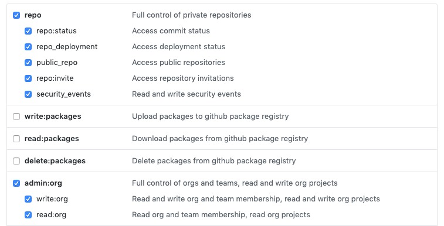

# Boston Digital Composer repository

To use this repository, add the following to your `~/.composer/config.json`:

```json
{
  "repositories": [
    {
      "type": "composer",
      "url": "https://boston-digital.github.io/composer/"
    }
  ]
}
```

Head over to [https://boston-digital.github.io/composer/]() to browse available packages.

Notes:

* actual composer repository is on [gh-pages](https://www.github.com/boston-digital/composer/tree/gh-pages) branch.
* if Composer complains that private packages can't be found, run `composer clearcaches`

## Updating repo

1. Change into the root directory of this repo
2. Run `make` - this will build the necessary files in the `dist` directory
3. Change into `dist` directory and push all changed files to origin

## Advanced Custom Fields Pro

The `scripts/acf.sh` script will check if there is a newer version of ACF and create
a release in our private [boston-digital/wp-advanced-custom-fields-pro](https://github.com/boston-digital/wp-advanced-custom-fields-pro)
repo.

### Usage
If you haven't already, create an `.env` file in the root of this repo. 

```shell script
# ACF_PRO_KEY can be found in Keeper:
# Advanced Custom Fields ACF (Developer License for all WordPress Sites)
ACF_PRO_KEY=''
# Your GitHub user name
GITHUB_USER=''
# Your personal GitHub access token from https://github.com/settings/tokens
GITHUB_TOKEN=''
```

NOTE: Your personal access token needs the following scopes:



After you've created the `.env` file, run `scripts/acf.sh` from the root of the repo. If
your computer is missing any required dependencies the script will fail and let you know
how to install them.
